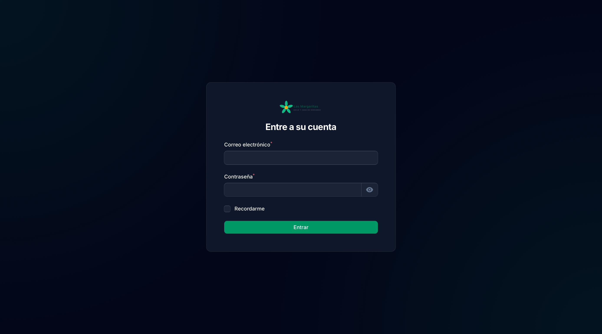
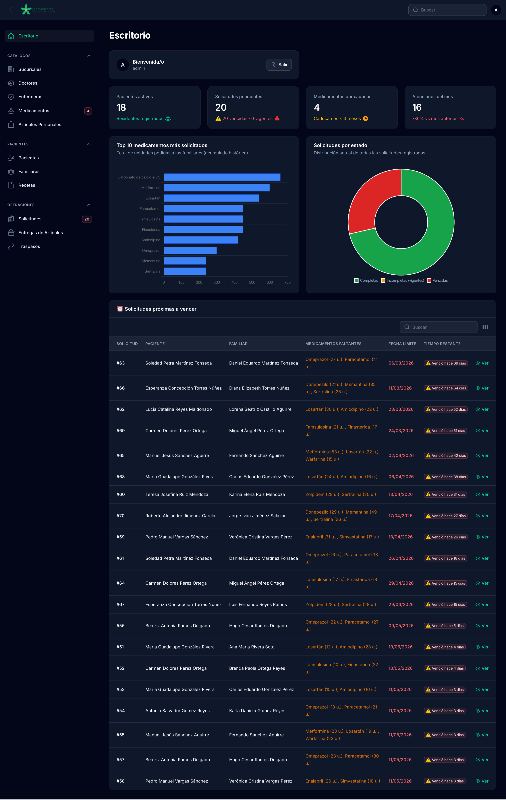
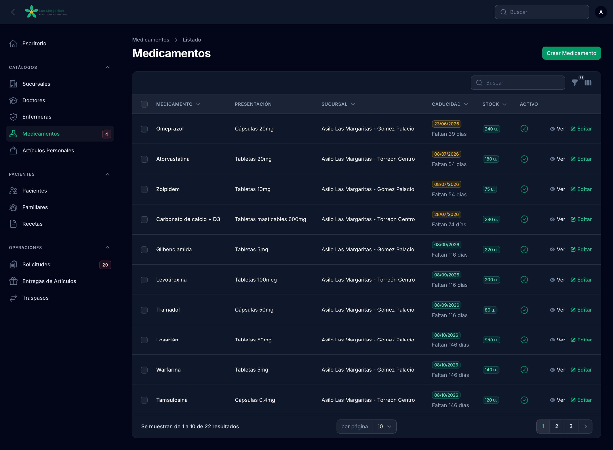
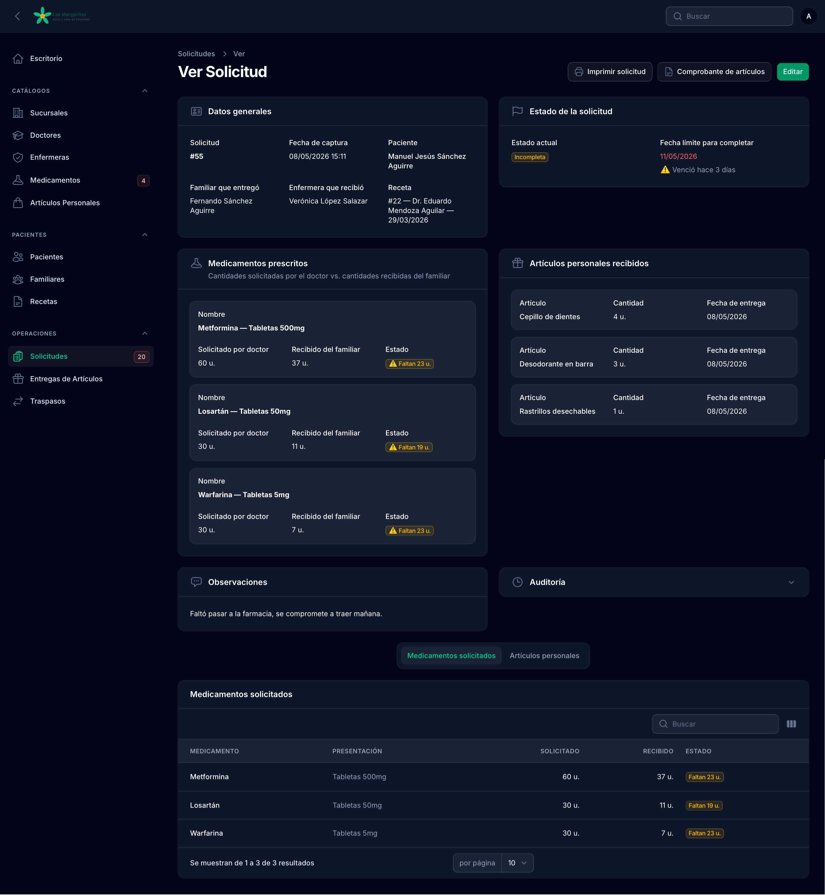
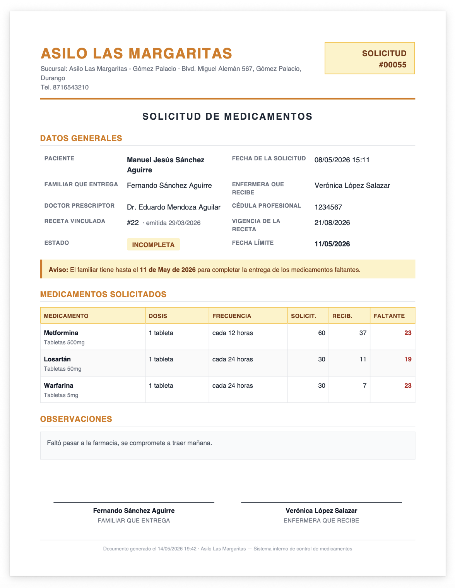

<div align="center">


# Asilo Las Margaritas

### Sistema de gestión de medicamentos y artículos personales para asilos

[](https://www.php.net)
[](https://laravel.com)
[](https://filamentphp.com)
[](https://www.sqlite.org)
[](https://tailwindcss.com)
[](LICENSE)

</div>

---

## Acerca del proyecto

**Asilo Las Margaritas** es un sistema integral de gestión hospitalaria diseñado para asilos y casas de descanso. Resuelve el problema concreto del control de medicamentos que traen los familiares para sus residentes, así como el registro de artículos personales, recetas médicas y entregas a lo largo del tiempo.

El sistema fue construido como proyecto académico para la materia de **Ingeniería de Software** en el Instituto Tecnológico de La Laguna, modelando un caso real de un asilo con dos sucursales en la región Laguna (Torreón y Gómez Palacio).

### Problema que resuelve

Los asilos manejan diariamente decenas de medicamentos y artículos personales para cada residente. Las recetas vencen, los medicamentos caducan, los familiares no siempre traen las cantidades completas, y los traspasos entre sucursales requieren control estricto. Este sistema centraliza todo el flujo desde la recepción del familiar hasta la entrega al paciente, con trazabilidad completa y documentos imprimibles para constancia legal.

### Características principales

- **Gestión completa de catálogos** — Sucursales, doctores, enfermeras, medicamentos (con control de caducidad), artículos personales
- **Registro de pacientes y familiares** — Con relaciones N:M para que un paciente tenga múltiples familiares responsables
- **Recetas médicas** — Doctores prescriben con dosis, frecuencia, cantidad total y duración por medicamento
- **Solicitudes con wizard** — Flujo de 4 pasos guiado para registrar la llegada de medicamentos
- **Sistema de roles y permisos** — 4 perfiles con accesos diferenciados (admin, recepcionista, doctor, enfermera)
- **Dashboard ejecutivo** — KPIs, gráficas (donut de estados, ranking de medicamentos), tabla de solicitudes próximas a vencer
- **PDFs profesionales** — Hoja de solicitud impresa y comprobante de artículos para el familiar
- **Validaciones de negocio** — Caducidad mínima de medicamentos (3 meses), vigencia de recetas, faltantes en rojo
- **Tema custom completo** — Logo SVG adaptativo, paleta verde Emerald, fuente Inter, modo claro/oscuro

---

## Capturas

<div align="center">

### Pantalla de inicio de sesión


### Dashboard ejecutivo


### Listado de medicamentos con control de caducidad


### Vista detallada de una solicitud


### PDF imprimible de solicitud


</div>

---

## Stack tecnológico

| Categoría | Tecnología | Versión |
|---|---|---|
| Lenguaje backend | PHP | 8.4 |
| Framework | Laravel | 12 |
| Panel administrativo | Filament | 5.6 |
| Base de datos | SQLite | 3 |
| Frontend / Estilos | TailwindCSS | 4 |
| Empaquetador | Vite | 8 |
| Generación PDF | DomPDF (barryvdh/laravel-dompdf) | 3.x |
| Localización ES | laravel-lang/common | 17.x |
| Servidor local | Laravel Herd | — |

### Patrones y prácticas aplicadas

- **Eloquent ORM** con relaciones `BelongsTo`, `HasMany`, `BelongsToMany` con pivot data
- **Policies** con discovery automático y hook `before()` para roles de admin
- **Form Request Validation** con mensajes localizados al español
- **Seeders idempotentes** que pueden re-ejecutarse sin duplicar datos
- **Resource pattern de Filament** con clases separadas (Form, Table, Infolist, Pages)
- **Custom theme CSS** compilado con Vite + Tailwind v4
- **PHP 8.4 attributes** (`#[Fillable]`, `#[Hidden]`) en lugar de propiedades tradicionales
- **Tipado estricto** y match expressions modernos

---

## Requisitos del sistema

Antes de instalar, asegúrate de tener:

- **PHP 8.4+** (con extensiones `pdo_sqlite`, `mbstring`, `xml`, `gd`)
- **Composer 2.x**
- **Node.js 20+** y **npm**
- **Git**
- Editor de código recomendado: **VS Code** o **PhpStorm**

### En macOS recomendamos

[Laravel Herd](https://herd.laravel.com) — instala PHP, Composer y un servidor local con un click. El proyecto fue desarrollado y probado con Herd.

---

## Instalación

### 1. Clonar el repositorio

```bash
git clone https://github.com/rodricksito/asilo-las-margaritas.git
cd asilo-las-margaritas
```

### 2. Instalar dependencias PHP

```bash
composer install
```

### 3. Instalar dependencias JavaScript

```bash
npm install
```

### 4. Configurar el archivo de entorno

```bash
cp .env.example .env
php artisan key:generate
```

Esto crea tu `.env` local y genera una `APP_KEY` única para tu instalación.

### 5. Crear la base de datos SQLite

```bash
touch database/database.sqlite
```

### 6. Correr migraciones y seeders

```bash
php artisan migrate --seed
```

Este comando crea las 15 tablas y carga datos demo realistas: 2 sucursales, 4 doctores, 5 enfermeras, 22 medicamentos, 12 artículos personales, 18 pacientes con sus familiares, 70 solicitudes históricas, etc.

### 7. Crear los usuarios demo (uno por rol)

```bash
php artisan db:seed --class=DemoUsersSeeder
```

Esto crea 4 cuentas para probar los distintos perfiles (ver sección **Credenciales** más abajo).

### 8. Compilar los assets

```bash
npm run build
```

### 9. Levantar el servidor

**Con Herd** (recomendado en macOS): visita `http://asilo-las-margaritas.test/admin`.

**Sin Herd:** corre `php artisan serve` y visita `http://localhost:8000/admin`.

---

## Credenciales de prueba

Después de correr los seeders, podrás iniciar sesión con cualquiera de estos 4 usuarios. **Todas usan la contraseña `password`**.

| Email | Rol | Acceso |
|---|---|---|
| `admin@asilo.test` | Administrador | Todo el sistema sin restricciones |
| `recepcion@asilo.test` | Recepcionista | Pacientes, familiares, solicitudes, entregas |
| `doctor@asilo.test` | Doctor | Recetas (CRUD) + consultas |
| `enfermera@asilo.test` | Enfermera | Solicitudes y entregas (CRUD) + consultas |

---

## Roles y permisos

El sistema implementa autorización granular con Laravel Policies. Esta tabla resume qué puede hacer cada rol:

| Recurso | Admin | Recepcionista | Doctor | Enfermera |
|---|:---:|:---:|:---:|:---:|
| Sucursales | CRUD | — | — | — |
| Doctores · Enfermeras · Medicamentos | CRUD | ver | ver | ver |
| Artículos personales | CRUD | ver | — | ver |
| Pacientes · Familiares | CRUD | CRUD | ver | ver |
| Recetas | CRUD | ver | CRUD* | ver |
| Solicitudes | CRUD | CRUD | ver | CRUD |
| Entregas de artículos | CRUD | CRUD | — | CRUD |
| Traspasos | CRUD | — | — | — |

\* El doctor solo puede editar las recetas que él mismo emitió.

Para detalles del flujo de trabajo de cada rol, consulta el [manual de usuario](docs/manual-usuario.md).

---

## Estructura del proyecto

```
asilo-las-margaritas/
├── app/
│   ├── Filament/
│   │   ├── Resources/          # 11 Resources con CRUD completo
│   │   │   ├── Sucursals/
│   │   │   ├── Doctors/
│   │   │   ├── Enfermeras/
│   │   │   ├── Medicamentos/
│   │   │   ├── ArticuloPersonals/
│   │   │   ├── Pacientes/
│   │   │   ├── Familiares/
│   │   │   ├── Recetas/
│   │   │   ├── Solicituds/     # Wizard de 4 pasos + Infolist
│   │   │   ├── EntregaArticulos/
│   │   │   └── Traspasos/
│   │   └── Widgets/            # 4 widgets del dashboard
│   ├── Http/
│   │   └── Controllers/        # SolicitudPdfController
│   ├── Models/                 # 15 modelos Eloquent
│   ├── Policies/               # 12 policies (BasePolicy + 11 específicas)
│   └── Providers/
│       └── Filament/           # AdminPanelProvider con branding
├── database/
│   ├── migrations/             # 15 migrations
│   └── seeders/                # DemoSeeder + DemoUsersSeeder
├── docs/
│   ├── manual-usuario.md       # Manual por rol con flujos
│   ├── diagrama-er.md          # Diagrama ER en Mermaid
│   └── screenshots/            # Imágenes del README
├── public/
│   └── images/branding/        # Logos SVG adaptativos
├── resources/
│   ├── css/filament/admin/
│   │   └── theme.css           # Tema custom verde Emerald
│   └── views/
│       └── pdfs/               # Templates Blade de PDFs
└── routes/
    └── web.php                 # Rutas de PDFs protegidas con auth
```

---

## Modelo de datos

El sistema utiliza 15 tablas con relaciones bien definidas. Tres tablas pivot (`familiar_paciente`, `medicamento_receta`, `medicamento_solicitud`) manejan las relaciones N:M con datos adicionales en el pivote.

Consulta el [diagrama ER completo](docs/diagrama-er.md) para ver todas las entidades y sus relaciones visualizadas con Mermaid.

### Tablas principales

| Tabla | Descripción |
|---|---|
| `sucursales` | Centros físicos donde opera el asilo |
| `users` | Cuentas de acceso al sistema (con rol y sucursal) |
| `doctores` | Médicos que emiten recetas |
| `enfermeras` | Personal de enfermería con turno |
| `medicamentos` | Inventario con stock y caducidad |
| `articulos_personales` | Catálogo de artículos de uso del residente |
| `pacientes` | Residentes del asilo |
| `familiares` | Personas responsables de los pacientes |
| `familiar_paciente` | Pivote con tipo de parentesco |
| `recetas` | Prescripciones médicas con vigencia |
| `medicamento_receta` | Pivote con dosis, frecuencia, cantidad, duración |
| `solicitudes` | Registro de cada visita del familiar trayendo medicamentos |
| `medicamento_solicitud` | Pivote con cantidad solicitada vs recibida |
| `entregas_articulos` | Artículos personales que el familiar entrega |
| `traspasos` | Movimientos de inventario entre sucursales |

---

## Cobertura de requisitos del PDF original

El sistema cumple con los 14 requisitos del documento de especificación:

| # | Requisito | Estado |
|---|---|:---:|
| 1 | Registro de pacientes y contactos (familiares) | ✅ |
| 2 | Registro de usuarios | ✅ |
| 3 | Generación de entradas (solicitudes) | ✅ |
| 4 | Registro de medicamentos con caducidad ≥ 3 meses | ✅ |
| 5 | Sistema de búsqueda en todas las tablas | ✅ |
| 6 | Notificación de faltantes a familiares | ✅ |
| 7 | Imprimir solicitud de entrada | ✅ |
| 8 | Registro de objetos de uso personal | ✅ |
| 9 | Imprimir hoja de objetos personales | ✅ |
| 10 | Administración desde cualquier dispositivo | ✅ |
| 11 | Catálogos completos | ✅ |
| 12 | Reportes operativos | ✅ |
| 13 | Gráficas | ✅ |
| 14 | Roles y permisos diferenciados | ✅ |

---

## Comandos útiles para desarrollo

```bash
# Limpiar todos los caches de Laravel
php artisan optimize:clear

# Optimizar Filament después de cambios en Resources
php artisan filament:optimize

# Refrescar la base de datos desde cero (¡borra todo!)
php artisan migrate:fresh --seed
php artisan db:seed --class=DemoUsersSeeder

# Compilar assets en modo desarrollo (con hot reload)
npm run dev

# Compilar assets para producción
npm run build

# Entrar a tinker (REPL de Laravel)
php artisan tinker
```

---

## Contexto académico

| Concepto | Detalle |
|---|---|
| **Institución** | Tecnológico Nacional de México — Campus Instituto Tecnológico de La Laguna |
| **Carrera** | Ingeniería en Sistemas Computacionales |
| **Materia** | Ingeniería de Software |
| **Grupo** | B16B |
| **Profesor** | Oscar Pérez |
| **Periodo** | 2026 |

---

## Equipo de desarrollo

Este proyecto fue desarrollado por el **Equipo 2**:

| Nombre | Matrícula |
|---|---|
| Axel Arturo Carrillo Muñoz | 23130013 |
| Angel Rodrigo Hinostroza Rodríguez | 23130003 |
| Jesús Adrián Muñoz Castillo | 23130056 |

---

## Licencia

Este proyecto está licenciado bajo la licencia MIT. Consulta el archivo [LICENSE](LICENSE) para más información.

---

<div align="center">

**Asilo Las Margaritas** · 2026 · Equipo 2 · ITLAG

</div>
