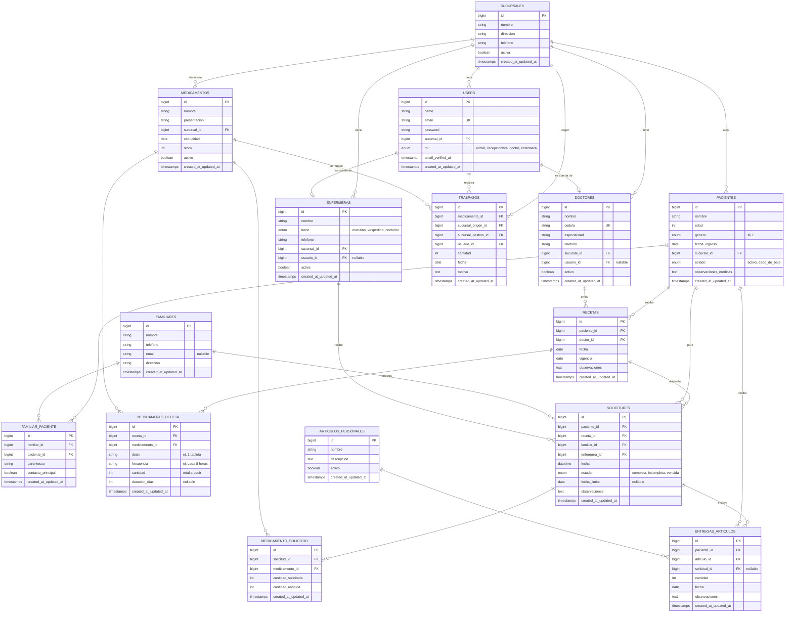

# Diagrama Entidad-Relación

Este documento contiene el modelo de datos completo del sistema **Asilo Las Margaritas**, expresado como un diagrama ER en Mermaid (se renderiza automáticamente al verlo en GitHub).

---

## Visión general

El sistema utiliza **15 tablas** organizadas en tres áreas conceptuales:

1. **Catálogos** — Entidades maestras (sucursales, doctores, enfermeras, medicamentos, artículos personales)
2. **Pacientes** — Residentes del asilo y sus familiares responsables
3. **Operaciones** — Recetas, solicitudes de medicamentos, entregas de artículos y traspasos

---

## Diagrama completo

---

## Notas sobre el modelo

### Relaciones N:M con pivot enriquecido

Tres tablas pivot almacenan **datos adicionales en el pivote**, no solo las claves foráneas:

| Tabla pivot | Datos adicionales |
|---|---|
| `familiar_paciente` | Parentesco, contacto principal |
| `medicamento_receta` | Dosis, frecuencia, cantidad, duración en días |
| `medicamento_solicitud` | Cantidad solicitada vs. cantidad recibida |

Esto permite, por ejemplo, que el mismo medicamento (Metformina) pueda estar en múltiples recetas con dosis distintas para pacientes distintos.

### Estados calculados de solicitudes

El campo `estado` de `solicitudes` se mantiene actualizado mediante scopes en el modelo Eloquent:

- **`completa`** — Todos los medicamentos solicitados fueron recibidos (suma de `cantidad_recibida` = suma de `cantidad_solicitada`)
- **`incompleta`** — Faltan medicamentos, pero la `fecha_limite` aún no vence
- **`vencida`** — Faltan medicamentos y la `fecha_limite` ya pasó

### Cuentas de usuario opcionales para personal médico

Los campos `usuario_id` en `doctores` y `enfermeras` son **nullable**. Esto permite registrar personal en los catálogos sin obligatoriamente crearles cuenta de acceso al sistema (por ejemplo, un médico externo de cabecera que solo prescribió una receta inicial).

### Soft deletes

El sistema **no usa soft deletes** intencionalmente. En su lugar, los registros tienen campos `activo` / `activa` / `estado` que permiten ocultarlos sin perder integridad referencial. Esto facilita auditorías retrospectivas: una receta de hace 6 meses sigue siendo legible aunque su doctor ya esté inactivo.

### Cascadas

Las claves foráneas usan `onDelete('restrict')` por default. Eliminar registros centrales (paciente, doctor, sucursal) requiere primero limpiar sus dependencias. Esto evita borrados accidentales en producción.

---

## Convenciones de nomenclatura

- **Tablas**: plural en español snake_case (`sucursales`, `articulos_personales`)
- **Modelos**: singular en español PascalCase (`Sucursal`, `ArticuloPersonal`)
- **Foreign keys**: nombre_modelo_id en snake_case (`sucursal_id`, `paciente_id`)
- **Pivotes**: nombres de las dos tablas en singular alfabético (`familiar_paciente`, `medicamento_receta`)
- **Booleanos**: prefijo o sufijo descriptivo (`activo`, `activa`, `contacto_principal`)
- **Timestamps**: estándar Laravel (`created_at`, `updated_at`)
